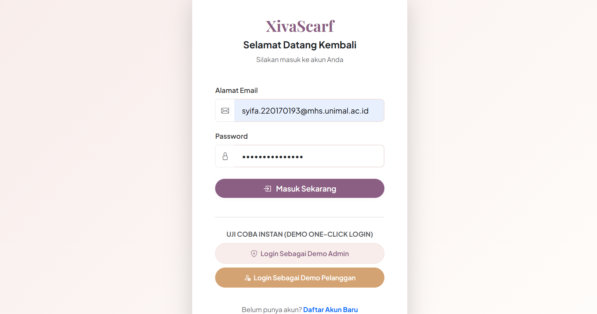
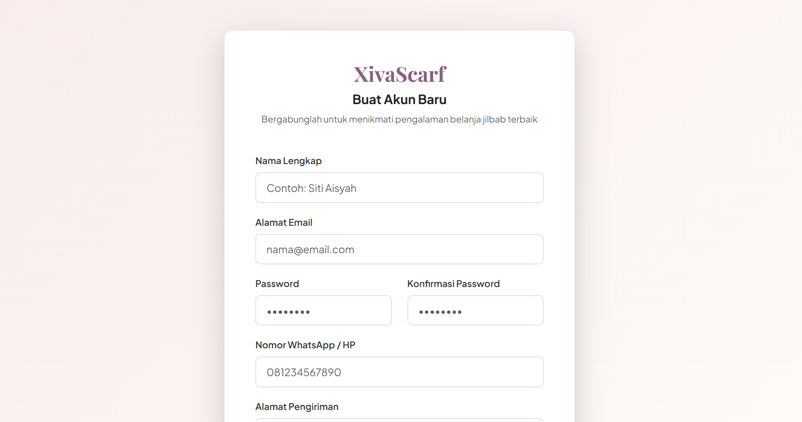
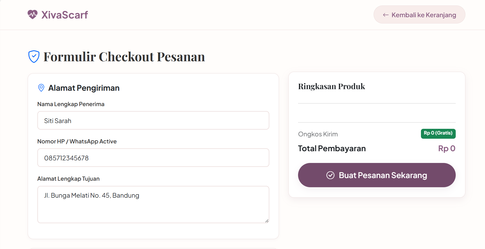
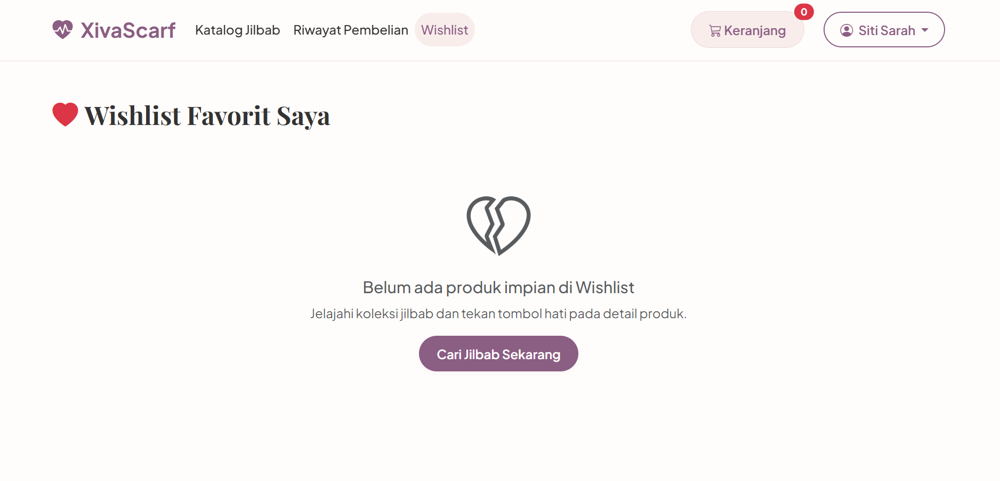

XivaScarf - Sistem Penjualan Jilbab Berbasis Web

XivaScarf adalah aplikasi e-commerce boutique penjualan jilbab modern berbasis web yang mengintegrasikan **Firebase Authentication**, **Cloud Firestore**, **Bootstrap 5**, **Chart.js** untuk grafik statistik penjualan admin, serta **jsPDF** & **SheetJS (XLSX)** untuk laporan transaksi.

---
👨‍🎓 Identitas Mahasiswa

- Nama : Syifa ulmuna
- NIM : 220170193
  
---
🌟 Fitur Utama

🛠️ Fitur Admin
- **Dashboard Statistik & KPI**: Ringkasan jumlah produk, total pelanggan, jumlah pesanan, dan total omzet penjualan.
- **Grafik Penjualan Interaktif (Chart.js)**: Line chart grafik penjualan bulanan, doughnut chart produk terlaris, dan bar chart kategori terpopuler.
- **CRUD Produk Jilbab**: Tambah, edit, hapus, dan cari produk dengan dukungan preview gambar, varian warna, ukuran, dan penyesuaian stok.
- **CRUD Kategori**: Tambah dan kelola kategori jilbab (Pashmina, Segiempat, Instant, Bergo, Syar'i).
- **Pengelolaan Pesanan & Status**: Ubah status transaksi secara live (*Menunggu Pembayaran, Diproses, Dikirim, Selesai, Dibatalkan*).
- **Data Pelanggan**: Daftar pengguna terdaftar beserta riwayat total transaksi.
- **Laporan Penjualan & Ekspor**: Filter laporan transaksi (Harian, Bulanan, Tahunan, Custom Tanggal) serta ekspor instan ke format **PDF** dan **Excel (XLSX)**.

🛍️ Fitur Pelanggan (Customer)
- **Katalog Jilbab Interactive**: Pencarian live dan filter cepat berdasarkan kategori.
- **Detail Produk**: Galeri gambar, informasi stok, pilihan warna, ukuran, serta tombol *Tambah ke Keranjang* dan *Wishlist*.
- **Keranjang Belanja**: Atur kuantitas item, kalkulasi otomatis subtotal dan total bayar, hapus item.
- **Checkout & Metode Pembayaran**: Pilihan pembayaran (Transfer Bank BCA, E-Wallet ShopeePay/GoPay/OVO, Cash On Delivery - COD), catatan pengiriman.
- **Riwayat Pembelian & Invoice**: Lacak status pengiriman dan cetak bukti transaksi/faktur pembelian.
- **Wishlist**: Simpan jilbab favorit untuk dibeli di kemudian hari.
- **Pengaturan Profil**: Kelola nama, nomor WhatsApp, dan alamat pengiriman utama.

---

🎨 Tema Warna Design System

| Elemen | Kode Warna | Visual |
|---|---|---|
| **Primary** | `#8B5E83` | Mauve Rose / Plum Soft |
| **Secondary** | `#F8EDEB` | Warm Blush Cream |
| **Accent** | `#D4A373` | Camel / Warm Gold |
| **Background** | `#FFFDFB` | Soft Warm Off-White |
| **Text** | `#333333` | Charcoal Dark |

---

🚀 Uji Coba Instan (Demo Mode & Firebase Support)

Aplikasi XivaScarf dilengkapi dengan **Dual-Mode Data Layer**:
1. **Live Firebase Mode**: Menghubungkan secara otomatis ke Firebase Auth & Firestore dengan mengatur konfigurasi di `js/firebase-config.js`.
2. **Instant Local Demo Mode**: Jika dijalankan langsung di peramban, data awal (*seed data*) produk, kategori, pesanan, dan pengguna otomatis terisi sehingga seluruh fitur Admin & Pelanggan dapat diuji coba seketika tanpa konfigurasi tambahan!

Akun Uji Coba Demo:
- **Admin**:
  - Email: `admin@xivascarf.com`
  - Password: `admin123`
- **Pelanggan / User**:
  - Email: `user@xivascarf.com`
  - Password: `user123`

---

📁 Struktur Folder

```text
xivascarf/
│
├── index.html              # Halaman Landing Page Utama
├── login.html              # Halaman Login (dengan tombol Demo One-Click)
├── register.html           # Halaman Pendaftaran Akun
├── verify-email.html       # Halaman Verifikasi Email
│
├── admin/                  # Portal Administrator
│   ├── dashboard.html      # Dashboard Ringkasan & Grafik Chart.js
│   ├── produk.html         # Daftar Produk & Aksi CRUD
│   ├── tambah-produk.html  # Form Tambah Produk Baru
│   ├── edit-produk.html    # Form Edit Produk
│   ├── kategori.html       # Kelola Kategori Jilbab
│   ├── pesanan.html        # Kelola Pesanan & Status
│   ├── pelanggan.html      # Data Pelanggan Terdaftar
│   ├── laporan.html        # Laporan Penjualan & PDF/Excel Export
│   └── profil.html         # Profil Administrator
│
├── user/                   # Portal Pelanggan / Customer
│   ├── dashboard.html      # Ringkasan Akun Pelanggan
│   ├── home.html           # Katalog Belanja & Filter
│   ├── detail-produk.html  # Rincian Produk Jilbab
│   ├── keranjang.html      # Keranjang Belanja
│   ├── checkout.html       # Checkout & Pembayaran
│   ├── riwayat.html        # Riwayat Pesanan & Invoice
│   ├── profil.html         # Pengaturan Profil & Alamat
│   └── wishlist.html       # Jilbab Favorit Tersimpan
│
├── css/
│   ├── style.css           # Core Design Tokens & Visual Styles
│   ├── dashboard.css       # Layout Portal Customer
│   ├── admin.css           # Layout Portal Admin & Sidebar
│   └── responsive.css      # Breakpoints & Media Queries
│
├── js/
│   ├── firebase-config.js  # Konfigurasi Firebase & Local DBStore Engine
│   ├── auth.js             # Session & Authentication Guard
│   ├── login.js            # Login Logic Controller
│   ├── register.js         # Register Logic Controller
│   ├── dashboard.js        # Admin Analytics & Chart.js Visualizer
│   ├── produk.js           # Catalogue & Product Management
│   ├── kategori.js         # Category Controller
│   ├── keranjang.js        # Cart Logic & Quantity Handler
│   ├── checkout.js         # Order Submission & Payment Selector
│   ├── laporan.js          # Export PDF (jsPDF) & Excel (SheetJS)
│   └── role.js             # Dynamic Navigation & Role Protection
│
└── README.md               # Dokumentasi Proyek
```

---

💻 Panduan Menjalankan Aplikasi

1. Buka folder proyek `xivascarf/` di browser pilihan Anda (Google Chrome, Edge, Firefox, Safari).
2. Jalankan `index.html` atau langsung buka `login.html`.
3. Klik tombol **Login Sebagai Demo Admin** untuk menguji dashboard pengelola, grafik Chart.js, CRUD produk/kategori, dan ekspor laporan PDF/Excel.
4. Klik tombol **Login Sebagai Demo Pelanggan** untuk mencoba pengalaman belanja, menambah keranjang, checkout, dan melacak riwayat pesanan.

# 📸 Dokumentasi Aplikasi

## 1. Halaman Login



---

## 2. Halaman Register



---

## 3. Verifikasi Email Firebase


---

## 4. Dashboard Admin


---

## 5. CRUD Produk


---

## 6. CRUD Kategori


---

## 7. Kelola Pesanan


---

## 8. Data Pelanggan


---

## 9. Laporan Penjualan


---

## 10. Profil Admin


---

## 11. Dashboard User


---

## 12. Keranjang Belanja

.png)

---

## 13. Checkout



---

## 14. Riwayat Pembelian


---

## 15. Wishlist


